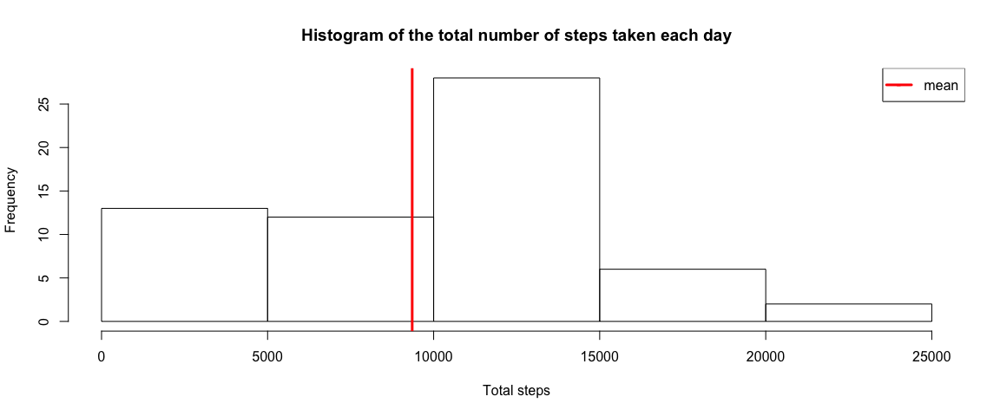
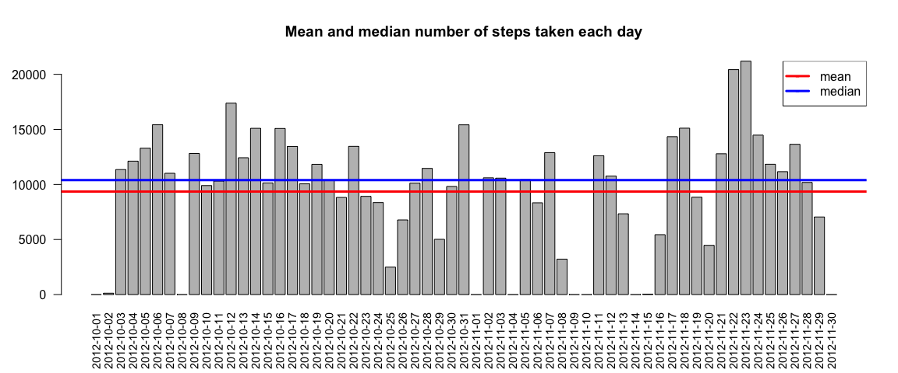
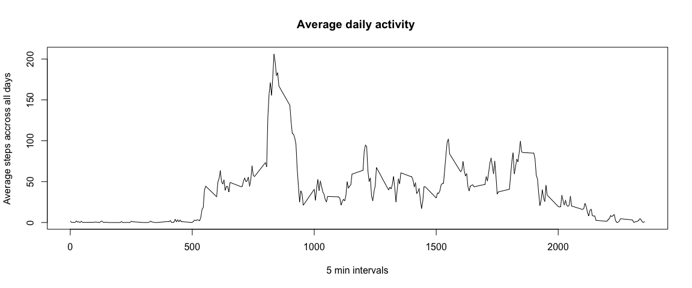
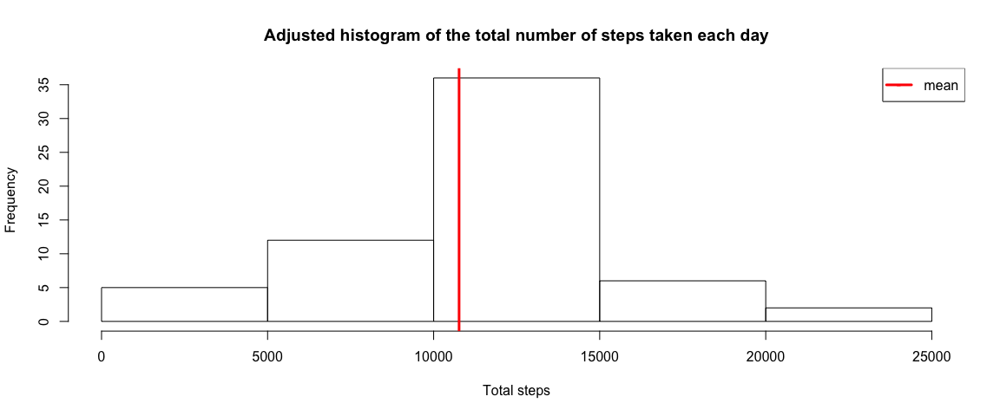
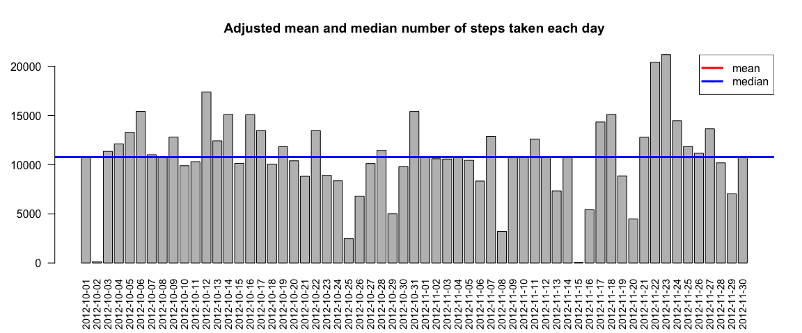
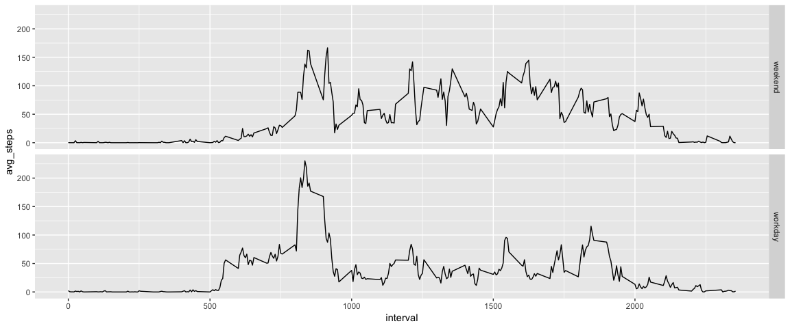

## Loading and preprocessing the data
Unzip and prepare data

```r
library(dplyr)
unzip("activity.zip")
activity <- tbl_df(read.csv("activity.csv", stringsAsFactors = FALSE))
activity$date <- as.Date(activity$date, "%Y-%m-%d")
str(activity)
```

```
## Classes 'tbl_df', 'tbl' and 'data.frame':	17568 obs. of  3 variables:
##  $ steps   : int  NA NA NA NA NA NA NA NA NA NA ...
##  $ date    : Date, format: "2012-10-01" "2012-10-01" ...
##  $ interval: int  0 5 10 15 20 25 30 35 40 45 ...
```

```r
summary(activity)
```

```
##      steps             date               interval     
##  Min.   :  0.00   Min.   :2012-10-01   Min.   :   0.0  
##  1st Qu.:  0.00   1st Qu.:2012-10-16   1st Qu.: 588.8  
##  Median :  0.00   Median :2012-10-31   Median :1177.5  
##  Mean   : 37.38   Mean   :2012-10-31   Mean   :1177.5  
##  3rd Qu.: 12.00   3rd Qu.:2012-11-15   3rd Qu.:1766.2  
##  Max.   :806.00   Max.   :2012-11-30   Max.   :2355.0  
##  NA's   :2304
```

## What is mean total number of steps taken per day?
### 1. Calculate the total number of steps taken per day
For this part of the assignment, you can ignore the missing values in the dataset

```r
per_day <- activity %>%
    group_by(date) %>%
    summarise(tot_steps = sum(steps, na.rm = T))
```

### 2. Make a histogram of the total number of steps taken each day


```r
require(dplyr)
steps <- per_day %>% filter(tot_steps > 0)
hist(per_day$tot_steps, main = "Histogram of the total number of steps taken each day", xlab = "Total steps")
abline(v = mean(per_day$tot_steps), col = "red", lwd = 3)
legend("topright", legend = c("mean"), col = c("red"), pch = "-", lwd = 3)
```

<!-- -->

### 3. Calculate and report the mean and median of the total number of steps taken per day
Draw total number of steps per day with mean and median

```r
barplot(per_day$tot_steps, names.arg = per_day$date, cex.names = 0.9, las = 2, main = "Mean and median number of steps taken each day")
abline(h=mean(per_day$tot_steps, na.rm = T), col="red", lwd = 3)
abline(h=median(per_day$tot_steps, na.rm = T), col="blue", lwd = 3)
legend("topright", legend = c("mean", "median"), col = c("red", "blue"), pch = "-", lwd = 3)
```

<!-- -->

## What is the average daily activity pattern?
### 1. Make a time series plot (i.e. \color{red}{\verb|type = "l"|}type="l") of the 5-minute interval (x-axis) and the average number of steps taken, averaged across all days (y-axis)

```r
require(dplyr)
per_interval <- activity %>% group_by(interval) %>% summarise(avg_steps = mean(steps, na.rm = TRUE))
plot(per_interval$interval, per_interval$avg_steps, type = "l", 
     main = "Average daily activity ", xlab = "5 min intervals", ylab = "Average steps accross all days")
```

<!-- -->

### 2. Which 5-minute interval, on average across all the days in the dataset, contains the maximum number of steps?

```r
max_avg <- filter(per_interval, avg_steps == max(avg_steps))
```

Maximum average number of steps **206.17** were done in interval **#835**

## Imputing missing values
Note that there are a number of days/intervals where there are missing values (coded as NA). The presence of missing days may introduce bias into some calculations or summaries of the data.

### 1. Calculate and report the total number of missing values in the dataset (i.e. the total number of rows with NAs)

```r
na_count <- sum(is.na(activity$steps))
```
Number if records with missing step values is **2304**

### 2. Devise a strategy for filling in all of the missing values in the dataset. The strategy does not need to be sophisticated. For example, you could use the mean/median for that day, or the mean for that 5-minute interval, etc.
We are going to re-use per_interval data frame to derive avarage steps for missing value per 5-minute interval.

```r
adjusted_activity <- left_join(activity, per_interval) %>% mutate(new_val = ifelse(is.na(steps), avg_steps, steps))
adjusted_per_day <- adjusted_activity %>%
    group_by(date) %>%
    summarise(tot_steps = sum(new_val))
```
### 3. Create a new dataset that is equal to the original dataset but with the missing data filled in.

```r
str(adjusted_activity)
```

```
## Classes 'tbl_df', 'tbl' and 'data.frame':	17568 obs. of  5 variables:
##  $ steps    : int  NA NA NA NA NA NA NA NA NA NA ...
##  $ date     : Date, format: "2012-10-01" "2012-10-01" ...
##  $ interval : int  0 5 10 15 20 25 30 35 40 45 ...
##  $ avg_steps: num  1.717 0.3396 0.1321 0.1509 0.0755 ...
##  $ new_val  : num  1.717 0.3396 0.1321 0.1509 0.0755 ...
```

### 4. Make a histogram of the total number of steps taken each day and Calculate and report the mean and median total number of steps taken per day.

```r
hist(adjusted_per_day$tot_steps, main = "Adjusted histogram of the total number of steps taken each day", xlab = "Total steps")
abline(v = mean(adjusted_per_day$tot_steps), col = "red", lwd = 3)
legend("topright", legend = c("mean"), col = c("red"), pch = "-", lwd = 3)
```

<!-- -->

```r
summary(adjusted_per_day$tot_steps)
```

```
##    Min. 1st Qu.  Median    Mean 3rd Qu.    Max. 
##      41    9819   10766   10766   12811   21194
```

```r
barplot(adjusted_per_day$tot_steps, names.arg = adjusted_per_day$date, cex.names = 0.9, las = 2, main = "Adjusted mean and median number of steps taken each day")
abline(h=mean(adjusted_per_day$tot_steps, na.rm = T), col="red", lwd = 3)
abline(h=median(adjusted_per_day$tot_steps, na.rm = T), col="blue", lwd = 3)
legend("topright", legend = c("mean", "median"), col = c("red", "blue"), pch = "-", lwd = 3)
```

<!-- -->

In comapison with original dataset the adjusted data looks more normal distributed.

## Are there differences in activity patterns between weekdays and weekends?
For this part the weekdays() function may be of some help here. Use the dataset with the filled-in missing values for this part.

### 1. Create a new factor variable in the dataset with two levels – “weekday” and “weekend” indicating whether a given date is a weekday or weekend day.

```r
weekday_steps <- adjusted_activity %>%
    mutate(wday = ifelse(weekdays(date) %in% c("Saturday", "Sunday"), "weekend", "workday")) %>%
    group_by(interval, wday) %>%
    summarise(avg_steps = mean(new_val, na.rm = T))
```

### 2. Make a panel plot containing a time series plot type="l") of the 5-minute interval (x-axis) and the average number of steps taken, averaged across all weekday days or weekend days (y-axis). 

```r
library(ggplot2)
qplot(interval, avg_steps, data = weekday_steps, geom = "line", facets=wday~.)
```

<!-- -->
